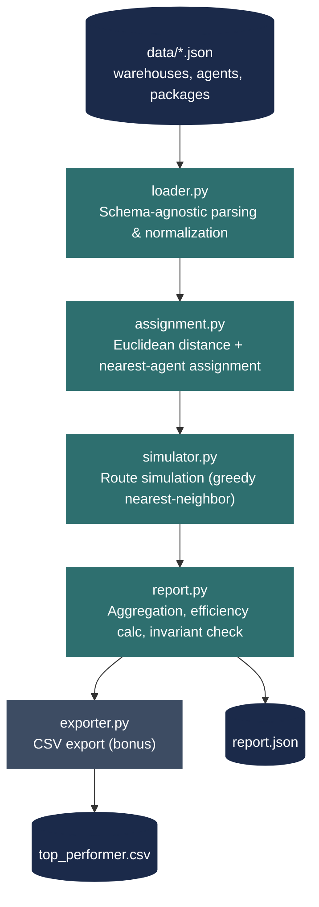

# FastBox Delivery System

A Python simulation engine for a fictional delivery company, FastBox. It assigns packages to the nearest available delivery agent, simulates each agent's full delivery route for one day of operations, and generates a performance report identifying the most efficient agent.

Built for the **Python Developer — Assignment Round**, Nexgensis Technologies Pvt. Ltd.

---

## Table of Contents

- [Overview](#overview)
- [Problem Statement](#problem-statement)
- [Architecture](#architecture)
- [How It Works](#how-it-works)
- [Installation](#installation)
- [Usage](#usage)
- [Testing](#testing)
- [Assumptions & Design Decisions](#assumptions--design-decisions)
- [Edge Cases Handled](#edge-cases-handled)
- [Sample Input / Output](#sample-input--output)
- [Bonus Features](#bonus-features)
- [Possible Future Improvements](#possible-future-improvements)
- [Note on Submission Timing](#note-on-submission-timing)

---

## Overview

FastBox operates a fleet of delivery agents out of multiple warehouses. On any given day, a batch of packages needs to be picked up from specific warehouses and delivered to specific destinations. This project simulates that single day of operations end-to-end:

1. **Load** warehouse, agent, and package data from a JSON file
2. **Assign** each package to whichever agent is nearest its pickup warehouse
3. **Simulate** each agent's route as they pick up and deliver their assigned packages
4. **Report** total distance traveled and delivery efficiency per agent, and identify the best performer
5. **Export** the top performer's stats to CSV as a bonus feature

The entire system is a dependency-free (stdlib-only) Python package, driven by a simple CLI, and validated against 11 independent test datasets.

## Problem Statement

**Input:** A JSON file describing:
- `warehouses` — fixed pickup locations, each with an (x, y) coordinate
- `agents` — delivery agents, each starting at an (x, y) coordinate
- `packages` — items to deliver, each tied to a source warehouse and a destination (x, y)

**Output:** A JSON report of the form:

```json
{
  "A1": {"packages_delivered": 2, "total_distance": 85.32, "efficiency": 42.66},
  "A2": {"packages_delivered": 2, "total_distance": 120.12, "efficiency": 60.06},
  "A3": {"packages_delivered": 1, "total_distance": 50.00, "efficiency": 50.00},
  "best_agent": "A1"
}
```

All distances are Euclidean (straight-line), and "efficiency" is distance-per-package — **lower is better**.

## Architecture

**Data flow through the pipeline:**



A modular package rather than a single monolithic script — each file maps to one responsibility, which keeps the logic testable in isolation and makes the codebase easy for a reviewer to audit piece by piece.

fastbox-delivery-system/
│
├── main.py CLI entry point — wires the full pipeline together
│
├── src/fastbox/
│ ├── init.py
│ ├── models.py Warehouse, Agent, Package — typed dataclasses
│ ├── loader.py Schema-agnostic JSON loader + normalizer
│ ├── assignment.py Euclidean distance + nearest-agent package assignment
│ ├── simulator.py Route simulation (greedy nearest-neighbor heuristic)
│ ├── report.py Report generation + invariant validation
│ └── exporter.py Bonus: CSV export of the top-performing agent
│
├── data/ Input datasets
│ ├── base_case.json Provided base case (list-of-objects schema)
│ └── test_case_1..10.json Provided variants (dict-keyed schema)
│
├── tests/
│ └── test_report.py pytest suite — runs the full pipeline against every file in data/
│
├── report.json Sample generated report
├── top_performer.csv Sample generated bonus export
├── requirements.txt pytest (dev-only; runtime uses stdlib exclusively)
└── README.md This file


**Data flow through the pipeline:**

data/*.json
│
▼
loader.py ──────► normalized Warehouse / Agent / Package objects
│
▼
assignment.py ────► each Package.assigned_agent set,
│ each Agent.packages_assigned filled in
▼
simulator.py ─────► per-agent {packages_delivered, total_distance}
│
▼
report.py ────────► final report dict, with efficiency + best_agent,
│ validated against the package-count invariant
▼
exporter.py ───────► top_performer.csv (bonus)
│
▼
report.json (main.py writes this to disk)


## How It Works

### 1. Loading (`loader.py`)
Reads the input JSON and normalizes it into `Warehouse`, `Agent`, and `Package` dataclasses (see [models.py](#architecture)). Critically, this loader is **schema-agnostic** — see [Assumptions](#assumptions--design-decisions) for why that matters.

### 2. Assignment (`assignment.py`)
For every package, the distance from each agent to that package's warehouse is looked up (precomputed once as a full agent × warehouse distance matrix — see rationale below), and the package is assigned to whichever agent is closest, with a deterministic tie-break rule when distances are equal.

### 3. Simulation (`simulator.py`)
Each agent then "travels" through their assigned packages: for every package, they move to its warehouse (pickup leg) and then to its destination (drop-off leg). Since a package must be picked up before it's delivered, but the order across *different* packages isn't specified anywhere in the brief, the agent picks whichever valid next stop (any pending pickup or any already-picked-up drop-off) is nearest at each step — a greedy nearest-neighbor heuristic.

### 4. Reporting (`report.py`)
Aggregates each agent's `packages_delivered` and `total_distance` into the final report shape, computes `efficiency = total_distance / packages_delivered`, and selects `best_agent` as whichever agent has the *lowest* efficiency value among agents who delivered at least one package. Before writing output, it asserts that total packages delivered across all agents equals the total packages in the input — a hard invariant explicitly required by the brief.

### 5. Export (`exporter.py`)
Bonus feature: writes the `best_agent`'s stats to `top_performer.csv`.

## Installation

No external runtime dependencies — pure Python 3 standard library.

```bash
git clone https://github.com/KishanDK/fastbox-delivery-system.git
cd fastbox-delivery-system
```

(Optional, for running tests) install pytest:
```bash
pip install -r requirements.txt
```

## Usage

```bash
python main.py --input data/base_case.json --output report.json
```

**Arguments:**
| Flag | Required | Default | Description |
|---|---|---|---|
| `--input` | Yes | — | Path to the input JSON file |
| `--output` | No | `report.json` | Path to write the generated report |

Running this also produces `top_performer.csv` in the current directory.

To run against any of the other provided datasets, just swap the `--input` path:
```bash
python main.py --input data/test_case_7.json --output report.json
```

## Testing

```bash
pip install pytest
pytest tests/ -v
```

The suite (`tests/test_report.py`) runs the **entire pipeline** — load, assign, simulate, report, validate — against **every JSON file in `data/`** (12 tests total: 11 datasets + 1 sanity check that the data files were actually found), asserting:
- The pipeline completes without raising
- Every package ends up assigned to an agent
- The total-packages-delivered invariant holds
- `best_agent` is always a real, present agent id

This directly satisfies the brief's explicit instruction to *"test your code with different JSON inputs"* rather than validating against only the single example shown in the assignment PDF.

## Assumptions & Design Decisions

The brief explicitly instructs that ambiguous logic should be resolved by assuming the most efficient reasonable approach, proceeding, and documenting the assumption rather than pausing for clarification. The following table captures every such decision made in this solution.

| # | Area | Assumption Made | Rationale |
|---|---|---|---|
| 1 | **Input schema** | The provided files use two different JSON schemas: `base_case.json` uses list-of-objects with `location` / `warehouse_id` keys, while the PDF's own example and `test_case_1–10.json` use dict-keyed objects with a `warehouse` key. `loader.py` detects the shape of each section at load time and normalizes both into one consistent internal model before any other module runs. | A loader hard-coded to a single shape would crash on roughly half of the provided test data. |
| 2 | **Assignment tie-break** | If two or more agents are exactly equidistant from a package's warehouse: prefer the agent with fewer packages already assigned (load balancing); if still tied, prefer the alphabetically-lowest agent ID. | Guarantees deterministic, reproducible output — the same input always produces the same report. |
| 3 | **Delivery order per agent** | When an agent has multiple packages, they visit pickups and drop-offs using a greedy nearest-neighbor heuristic: always move to the closest valid unvisited stop next. | The brief specifies no ordering rule. True globally-optimal routing is the Traveling Salesman Problem — computationally disproportionate at this scale. Nearest-neighbor is a standard, defensible "efficient" heuristic. |
| 4 | **Zero-package agents** | An agent assigned no packages is reported with `total_distance: 0.0` and `efficiency: null`, and is excluded from the `best_agent` comparison. | Without this, a divide-by-zero would occur, or an idle agent could win `best_agent` by default with a trivial 0.0 distance. |
| 5 | **"Efficiency" direction** | Lower `efficiency` value = better performance (`total_distance ÷ packages_delivered`). | Matches the sample report in the brief, where the agent named as `best_agent` has the *lowest* efficiency figure of the three. |
| 6 | **Distance metric** | All distances are straight-line (Euclidean), as explicitly specified in the brief — no road network, traffic, or obstacles are modeled. | Directly stated in the assignment brief. |

## Edge Cases Handled

- **Two different input schemas** in the same test suite (see Assumption #1)
- **Agents with zero assigned packages** (see Assumption #4) — occurs naturally in several of the larger provided test cases where an agent is geographically far from every warehouse
- **Missing or malformed sections** in the input JSON raise a clear, specific `ValueError` rather than an opaque traceback
- **Packages referencing an unknown warehouse ID** are caught and raise an explicit error at load time, before the simulation ever runs

## Sample Input / Output

Running against `data/base_case.json`:

```json
{
  "A1": {"packages_delivered": 2, "total_distance": 57.27, "efficiency": 28.64},
  "A2": {"packages_delivered": 2, "total_distance": 60.83, "efficiency": 30.41},
  "A3": {"packages_delivered": 1, "total_distance": 14.14, "efficiency": 14.14},
  "best_agent": "A3"
}
```

`top_performer.csv`:
```csv
agent_id,packages_delivered,total_distance,efficiency
A3,1,14.14,14.14
```

## Bonus Features

| Feature | Status |
|---|---|
| Export top performer to CSV | ✅ Implemented (`exporter.py`) |
| Random delivery delays | Not implemented — prioritized correctness and full test coverage of the core pipeline over additional bonus scope |
| ASCII route visualization | Not implemented (same reason) |
| New agent joining mid-day | Not implemented (same reason) |

## Possible Future Improvements

- Replace the nearest-neighbor routing heuristic with a proper local-search optimization (e.g. 2-opt) for larger package counts
- Add the remaining bonus features (ASCII visualization, delay simulation, mid-day agent joins)
- Add JSON schema validation with clearer error messages for malformed input
- Parallelize simulation across agents for very large datasets

## Note on Submission Timing

This assignment was completed in full but submitted after the stated 12:00 PM deadline due to a timezone/AM-PM misreading on my part during planning. I take responsibility for the delay and am submitting regardless, in case it can still be considered — happy to walk through the approach, code, or assumptions in more detail on request.